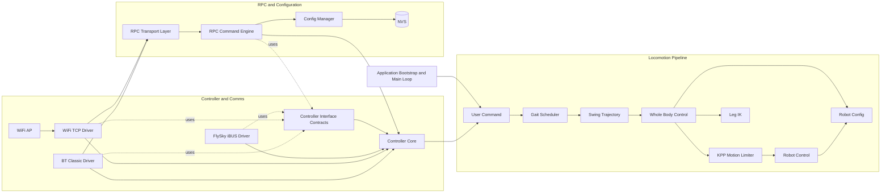
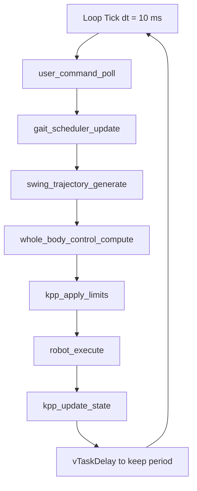
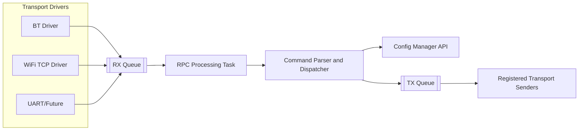
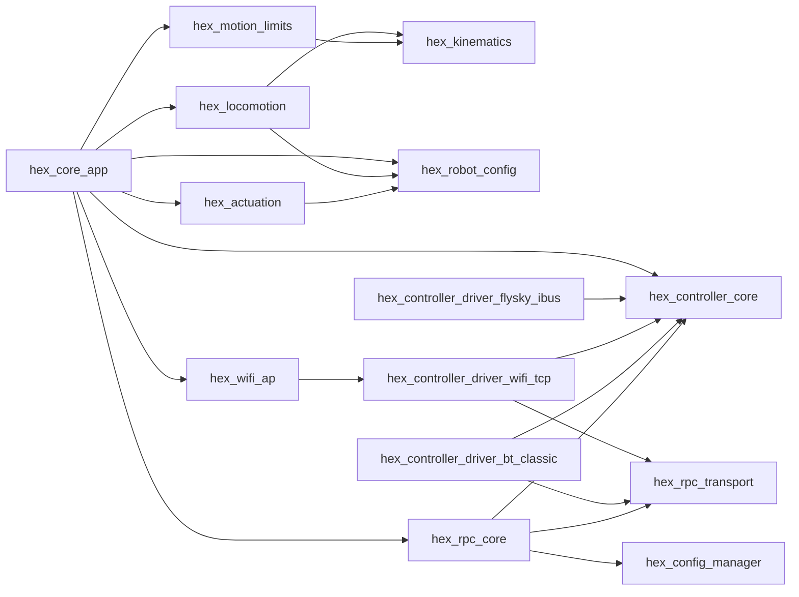

# Hexapod Component Architecture Baseline

## Purpose

This document captures the current software component architecture in the repository and defines a refactoring baseline toward ESP-IDF components.

Goals:
- describe what components exist today,
- describe how they interact at runtime,
- define dependency boundaries,
- provide a practical target split into ESP-IDF components.

This baseline is intentionally implementation-oriented and aligned with the current multi-component ESP-IDF layout rooted in `main` plus `components/*`.

## 1. Current Component Inventory

### 1.1 Application Orchestration

Component: Application Bootstrap and Loop
- Files: `main/main.c`
- Responsibilities:
	- initialize configuration manager,
	- initialize RPC subsystem,
	- initialize WiFi AP,
	- initialize robot configuration and controller drivers,
	- run the 10 ms locomotion loop.
- Main runtime pipeline:
	- `user_command_poll` -> `gait_scheduler_update` -> `swing_trajectory_generate` -> `whole_body_control_compute` -> `kpp_apply_limits` -> `robot_execute` -> `kpp_update_state`.

### 1.2 Locomotion Pipeline

Component: User Command Mapping
- Files: `components/hex_locomotion/user_command.c`, `components/hex_controller_core/user_command.h`
- Consumes: `controller` channel/state abstraction.
- Produces: normalized `user_command_t`.

Component: Gait Scheduler
- Files: `components/hex_locomotion/gait_scheduler.c`, `components/hex_locomotion/gait_scheduler.h`
- Consumes: `user_command_t`, `dt`.
- Produces: per-leg support/swing states and gait phase.

Component: Swing Trajectory Generator
- Files: `components/hex_locomotion/swing_trajectory.c`, `components/hex_locomotion/swing_trajectory.h`
- Consumes: scheduler state + user command.
- Produces: body-frame foot targets per leg.

Component: Whole Body Control
- Files: `components/hex_locomotion/whole_body_control.c`, `components/hex_locomotion/whole_body_control.h`
- Consumes: desired foot targets + robot mounting config.
- Uses: per-leg IK solver from `leg`.
- Produces: joint-angle command set for all legs.

Component: KPP Motion Limiter and State Estimation
- Files: `main/kpp_system.c`, `main/kpp_system.h`, `main/kpp_forward_kin.c`, `main/kpp_debug.c`
- Consumes: desired joint commands.
- Produces:
	- limited commands for actuator execution,
	- estimated joint and leg kinematic state.

Component: Robot Control (Actuation)
- Files: `components/hex_actuation/robot_control.c`, `components/hex_actuation/robot_control.h`
- Consumes: whole-body joint command set.
- Uses:
	- `robot_config` calibration and mapping,
	- MCPWM and LEDC drivers.
- Produces: servo PWM output.

Component: Robot Static and Runtime Configuration
- Files: `components/hex_robot_config/robot_config.c`, `components/hex_robot_config/robot_config.h`
- Responsibilities:
	- geometry and mount poses,
	- servo mapping and driver selection,
	- joint calibration accessors.

Component: Leg IK Library
- Files: `components/hex_kinematics/leg.c`, `components/hex_kinematics/leg.h`
- Responsibilities:
	- pure 3-DOF IK solve in leg-local frame.
- Notes:
	- does not drive hardware,
	- acts as reusable math primitive.

### 1.3 Controller and Communications

Component: Controller Core Abstraction
- Files: `components/hex_controller_core/controller.c`, `components/hex_controller_core/controller.h`, `components/hex_controller_core/controller_internal.h`
- Responsibilities:
	- shared channel cache with mutex,
	- connection/failsafe state,
	- dispatch to selected controller driver.

Component: Controller Interface Contracts
- Files:
	- `components/hex_controller_core/controller.h`,
	- `components/hex_controller_core/controller_internal.h`,
	- `components/hex_controller_core/user_command.h`.
- Responsibilities:
	- provide stable controller-facing API and internal driver ingress contracts,
	- remove component reliance on `main` private include paths,
	- centralize command/control shared types used by drivers, RPC, and locomotion mapping.

Component: Controller Drivers
- Files:
	- `components/hex_controller_driver_flysky_ibus/controller_flysky_ibus.c`,
	- `components/hex_controller_driver_wifi_tcp/controller_wifi_tcp.c`,
	- `components/hex_controller_driver_bt_classic/controller_bt_classic.c`.
- Responsibilities:
	- ingest transport-specific input,
	- map to canonical channel format,
	- forward text/RPC frames to RPC transport where needed,
	- push decoded channels directly to controller core ingress.

Component: WiFi AP Service
- Files: `components/hex_wifi_ap/wifi_ap.c`, `components/hex_wifi_ap/wifi_ap.h`
- Responsibilities:
	- AP setup and naming policy,
	- startup network availability for TCP diagnostics/control.

### 1.4 RPC and Persistent Configuration

Component: RPC Command Engine
- Files: `components/hex_rpc_core/rpc_commands.c`, `components/hex_rpc_core/rpc_commands.h`
- Responsibilities:
	- command parsing,
	- command dispatch (`get`, `set`, `setpersist`, `list`, `save`, etc.),
	- async task consuming RX queue.

Component: RPC Transport Abstraction
- Files: `components/hex_rpc_transport/rpc_transport.c`, `components/hex_rpc_transport/rpc_transport.h`
- Responsibilities:
	- RX queue (controllers -> RPC),
	- TX queue (RPC -> transport sender),
	- per-transport sender registration.

Component: Configuration Manager
- Files: `components/hex_config_manager/config_manager.c`, `components/hex_config_manager/config_manager.h`
- Responsibilities:
	- NVS-backed namespaces,
	- memory-only and persistent parameter writes,
	- system and joint calibration parameter APIs.

Component: Shared Cross-Module Types
- Files:
	- `components/hex_shared_types/controller_driver_types.h`
	- `components/hex_shared_types/types/joint_types.h`
- Responsibilities:
	- provide canonical, single-source enum/type definitions used by main, config, and controller-driver components,
	- prevent duplicate local header copies and include-path coupling.

Important observation:
- `main/rpc_system.h` exists but is currently empty. The functional RPC subsystem is in `components/hex_rpc_core/rpc_commands.*` and `components/hex_rpc_transport/rpc_transport.*`.

## 2. Current Runtime Interaction Diagrams

### 2.1 Top-Level Component Interaction

### 2.2 10 ms Control Loop Data Flow

### 2.3 RPC Queue-Centric Interaction

## 3. Component Contracts and Boundaries

### 3.1 Intended Direction of Dependencies

Rules:
- Locomotion pipeline must not depend on transport-specific controller drivers.
- Transport drivers must not call locomotion modules directly.
- RPC command engine should use public config/controller service APIs only.
- Math/kinematics components (`leg`, KPP math paths) should remain hardware-agnostic.
- Robot actuation is the only layer that touches MCPWM/LEDC driver APIs.

### 3.2 Coupling Risks to Address During Refactor

1. Header-level internal coupling:
- `controller_internal.h` is used by RPC and driver code; this is practical but tightly couples internals.

2. Feature placement ambiguity:
- RPC implementation is in `rpc_commands.*`, while `rpc_system.h` is empty.

3. Configuration ownership overlap:
- both `robot_config` and `config_manager` influence calibration and runtime behavior.

4. Networking startup path coupling:
- application bootstrap currently decides network bring-up ordering and secondary driver startup.

## 4. Target ESP-IDF Component Refactor Baseline

This section proposes a concrete decomposition into `components/` packages.

### 4.1 Proposed Components

1. `hex_core_app`
- role: app startup, task orchestration, lifecycle.
- owns: `app_main`, loop task creation, boot ordering.

2. `hex_locomotion`
- role: user command mapping, gait scheduler, swing trajectory, whole body control.
- owns: `user_command`, `gait_scheduler`, `swing_trajectory`, `whole_body_control`.

3. `hex_kinematics`
- role: leg IK and forward kinematics utilities.
- owns: `leg`, `kpp_forward_kin` math parts.

4. `hex_motion_limits`
- role: KPP state estimation and command limiting.
- owns: `kpp_system`, `kpp_debug`.

5. `hex_actuation`
- role: hardware actuation for joints.
- owns: `robot_control`.

6. `hex_robot_config`
- role: robot geometry, mount poses, servo mapping, calibration projection.
- owns: `robot_config`.

7. `hex_controller_core`
- role: normalized channel state, failsafe, driver dispatch interface.
- owns: `controller` public API plus refined internal interfaces.

8. `hex_controller_driver_flysky_ibus`
- role: FlySky iBUS driver.

9. `hex_controller_driver_wifi_tcp`
- role: WiFi TCP controller driver.

10. `hex_controller_driver_bt_classic`
- role: Bluetooth Classic controller driver.

11. `hex_wifi_ap`
- role: WiFi AP provisioning and status.

12. `hex_rpc_core`
- role: parser, command handlers, command task.
- owns: `rpc_commands` (or renamed `rpc_core`).

13. `hex_rpc_transport`
- role: transport queue abstraction and sender registry.
- owns: `rpc_transport`.

14. `hex_config_manager`
- role: NVS persistence and parameter APIs.
- owns: `config_manager`.

### 4.2 Target Dependency Diagram

### 4.3 Initial Refactor Sequence

1. Extract `rpc_transport` and `rpc_commands` into separate components with unchanged C APIs.
2. Extract `config_manager` as `hex_config_manager` and keep call sites unchanged.
3. Split controller core from each driver implementation into separate components.
4. Extract locomotion pipeline (`user_command`, `gait_scheduler`, `swing_trajectory`, `whole_body_control`) as one cohesive unit.
5. Extract `robot_control` as actuation component.
6. Extract KPP into `hex_motion_limits` with explicit dependency on kinematics and locomotion command types.
7. Normalize include boundaries and move internal headers to private include paths.

Progress note:
- Step 1 is implemented:
	- `rpc_transport` extracted to `components/hex_rpc_transport`
	- `rpc_commands` extracted to `components/hex_rpc_core`
- Step 2 is implemented as `components/hex_config_manager`.
- Step 3 is implemented using merged controller core and interfaces in `components/hex_controller_core`, with controller drivers extracted as dedicated components.
- Step 4 is implemented in `components/hex_locomotion`.
- Step 5 is implemented in `components/hex_actuation`.
- Foundational dependencies were extracted to support Step 4 include boundaries:
	- `components/hex_kinematics`
	- `components/hex_robot_config`

## 5. Definition of Done for Architecture Refactor Base

This document is considered complete as a refactor baseline when:
- each current source file is mapped to exactly one target component,
- dependency directions are documented and enforceable,
- runtime interactions are represented in diagrams,
- migration steps can be executed incrementally without behavior changes.

Current status: baseline complete and ready to drive component extraction tickets.

## 6. Execution Priority Update (Small-First + Config Must-Have)

Execution strategy update:
- start with small and low-coupling components,
- then execute config architecture refactor as a mandatory platform milestone,
- continue with larger pipeline components only after config platform split.

Recommended order:
1. `hex_rpc_transport`
2. `hex_wifi_ap`
3. controller leaf drivers (`hex_controller_driver_flysky_ibus`, `hex_controller_driver_wifi_tcp`, `hex_controller_driver_bt_classic`)
4. config platform refactor (`hex_config_api`, `hex_config_runtime`, `hex_config_registry`, `hex_config_storage_nvs`, `hex_config_migration`, domain modules)
5. locomotion, actuation, kinematics, and motion limits components

Rationale:
- Steps 1-3 are small and reduce risk while creating component boundaries.
- Step 4 is required before broad extraction because all components need stable shared settings access.

Detailed config review and decomposition:
- See `CONFIG_MANAGER_ARCHITECTURE_REVIEW.md`.
