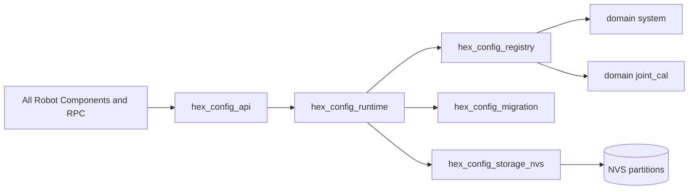

# Config Manager Architecture Review

## Scope

This review analyzes the current implementation in [main/config_manager.h](main/config_manager.h) and [main/config_manager.c](main/config_manager.c), lists its responsibilities, and proposes a separable architecture for a shared settings platform usable by all components.

## Current Responsibility Inventory

The current module is doing many jobs at once. Below is the complete responsibility map.

### 1. Storage and Partition Lifecycle

Responsibilities:
- initialize default and custom NVS partitions,
- erase and reinitialize partitions when NVS metadata is invalid,
- verify custom robot partition existence,
- open and hold NVS handles for each namespace.

Evidence:
- [main/config_manager.c](main/config_manager.c#L643)
- [main/config_manager.c](main/config_manager.c#L669)
- [main/config_manager.c](main/config_manager.c#L687)
- [main/config_manager.c](main/config_manager.c#L699)

### 2. Global Manager Runtime State

Responsibilities:
- maintain initialized flag,
- maintain namespace loaded and dirty flags,
- maintain namespace to NVS handle mapping,
- expose manager state snapshot.

Evidence:
- [main/config_manager.c](main/config_manager.c#L40)
- [main/config_manager.h](main/config_manager.h#L74)
- [main/config_manager.c](main/config_manager.c#L762)

### 3. Schema Versioning and Migration

Responsibilities:
- read and write global config version,
- execute migration chain from stored version to current,
- initialize namespace defaults during migration,
- enforce no downgrade policy.

Evidence:
- [main/config_manager.c](main/config_manager.c#L173)
- [main/config_manager.c](main/config_manager.c#L185)
- [main/config_manager.c](main/config_manager.c#L321)
- [main/config_manager.c](main/config_manager.c#L335)
- [main/config_manager.c](main/config_manager.c#L358)

### 4. Namespace Cache Ownership

Responsibilities:
- own in-memory typed cache for system config,
- own in-memory typed cache for joint calibration config,
- load defaults into cache,
- load persisted values into cache.

Evidence:
- [main/config_manager.c](main/config_manager.c#L43)
- [main/config_manager.c](main/config_manager.c#L46)
- [main/config_manager.c](main/config_manager.c#L389)
- [main/config_manager.c](main/config_manager.c#L485)
- [main/config_manager.c](main/config_manager.c#L1819)
- [main/config_manager.c](main/config_manager.c#L1860)

### 5. Serialization and NVS Key Mapping

Responsibilities:
- define NVS keys for all system fields,
- define NVS key templates for per-leg per-joint calibration,
- encode and decode floats as blobs,
- serialize and deserialize complete namespaces.

Evidence:
- [main/config_manager.c](main/config_manager.c#L52)
- [main/config_manager.c](main/config_manager.c#L72)
- [main/config_manager.c](main/config_manager.c#L569)
- [main/config_manager.c](main/config_manager.c#L609)

### 6. Parameter Name Parsing and Dynamic Addressing

Responsibilities:
- parse dynamic parameter names for joint calibration, such as leg2_femur_offset,
- map parsed fields to concrete struct members,
- translate between short and full joint names.

Evidence:
- [main/config_manager.c](main/config_manager.c#L111)
- [main/config_manager.c](main/config_manager.c#L1288)
- [main/config_manager.c](main/config_manager.c#L1349)

### 7. Type-Specific Access API Layer

Responsibilities:
- expose typed get and set functions for bool, int32, uint32, float, string,
- support both memory-only and persistent updates,
- apply namespace routing and per-type validation.

Evidence:
- [main/config_manager.h](main/config_manager.h#L269)
- [main/config_manager.c](main/config_manager.c#L1355)
- [main/config_manager.c](main/config_manager.c#L1589)

### 8. Metadata and Discovery API

Responsibilities:
- list namespaces,
- list parameters per namespace,
- return metadata and constraints for parameters,
- maintain metadata tables for system and joint_cal domains.

Evidence:
- [main/config_manager.h](main/config_manager.h#L379)
- [main/config_manager.c](main/config_manager.c#L1663)
- [main/config_manager.c](main/config_manager.c#L1715)
- [main/config_manager.c](main/config_manager.c#L1768)
- [main/config_manager.c](main/config_manager.c#L1090)

### 9. Domain Defaults and Factory Reset

Responsibilities:
- create default system domain values,
- create default joint calibration values,
- erase all namespaces and restore in-memory defaults.

Evidence:
- [main/config_manager.c](main/config_manager.c#L251)
- [main/config_manager.c](main/config_manager.c#L1819)
- [main/config_manager.c](main/config_manager.c#L1860)
- [main/config_manager.c](main/config_manager.c#L1881)

### 10. Legacy Compatibility API

Responsibilities:
- keep generic key-value get and set entry points,
- forward old interface to typed functions.

Evidence:
- [main/config_manager.h](main/config_manager.h#L415)
- [main/config_manager.c](main/config_manager.c#L1914)

### 11. Cross-Partition WiFi Utility

Responsibilities:
- read credentials from default WiFi partition using ESP-IDF keys.

Evidence:
- [main/config_manager.h](main/config_manager.h#L489)
- [main/config_manager.c](main/config_manager.c#L1978)

## Separation Feasibility

All responsibilities can be separated. Separation is strongly recommended.

### High Cohesion Groups

1. Storage Backend
- partition init, handle open/close, key read/write primitives.

2. Registry and Schema
- namespace registration, parameter tables, constraints, types.

3. Migration Engine
- version read/write and migration chain.

4. Runtime Cache and Transactions
- in-memory snapshots, dirty tracking, commit semantics.

5. Domain Providers
- system domain, joint calibration domain, future domains.

6. Public Config API
- single entry point for all components with typed and generic access.

7. Optional Utilities
- WiFi credential bridge and other adapters.

## Proposed New Architecture

## Design Goals

- one shared settings platform for all components,
- no component needs direct NVS knowledge,
- easily extend namespaces and parameter sets with minimal code changes,
- domains can be added independently,
- migration and storage concerns isolated from domain logic,
- stable C API for runtime use and RPC tooling.

### Important Decisions

1. Namespace extension model must be registration-based, not switch-based.
- Why it matters: if hex_config_api or runtime keeps hardcoded if/switch routing by namespace, extension pain returns even after split.
- Decision: each namespace provides a descriptor and registers once at startup.

2. Domain contract must include full lifecycle hooks.
- Why it matters: add namespace once, then automatically participate in defaults, load, save, list, metadata, and validation flows.
- Decision: descriptor includes callbacks for defaults, load, save, typed get/set, list parameters, and get parameter info.

3. Registry must be the single source of truth for namespace identity.
- Why it matters: avoid drift between enum values, string literals, and module wiring.
- Decision: runtime and API resolve namespaces through registry lookup only.

4. Migration ownership must be explicit per namespace.
- Why it matters: adding a namespace should not require touching unrelated migration logic paths.
- Decision: global migration orchestrates; namespace migration steps are provided by each domain module.

5. Extension acceptance criteria should be testable.
- Why it matters: prevents regressions where new namespaces require edits in multiple generic modules.
- Decision: add concrete "new namespace" and "new parameter" change-budget checks to Phase 2 exit criteria.

## Target Component Split

1. hex_config_api
- public headers only,
- stable typed API and discovery API,
- no NVS code.

2. hex_config_runtime
- cache store,
- dirty flags,
- load, apply, commit orchestration,
- optional read-write lock for concurrency,
- generic dispatch through registered namespace descriptors only.

3. hex_config_registry
- namespace and parameter metadata registry,
- domain registration at startup,
- lookup by namespace and parameter,
- canonical namespace descriptor ownership.

4. hex_config_storage_nvs
- NVS partition lifecycle,
- namespace KV read and write,
- typed encode and decode.

5. hex_config_migration
- schema version keys,
- ordered migration steps,
- migration state machine.

6. hex_config_domain_system
- system defaults,
- system metadata table,
- system validation hooks.

7. hex_config_domain_joint_cal
- joint calibration defaults,
- joint parameter parser and metadata builder,
- joint-specific validation hooks.

8. hex_config_compat
- legacy wrappers such as config_get_parameter and config_set_parameter.

9. hex_config_wifi_bridge optional
- WiFi partition read helper kept out of core settings path.

## Interaction Diagram

## What This Solves For Global Access

- Every component links to hex_config_api only.
- Domains remain independent and can be owned by their component teams.
- New domain example motion_limits can be added without touching storage backend.
- RPC discovery commands can use registry uniformly across all domains.
- New namespace onboarding becomes predictable and low-touch.

## Small-First Refactor Plan With Config Must-Have

The sequence below follows small components first while making config redesign an early mandatory milestone.

### Phase 0 Low-Risk Prep

1. Freeze current public behavior with lightweight tests for system and joint_cal get set and save paths.
2. Add a compatibility header map so old function names remain callable during migration.

### Phase 1 Small Component Extractions First

1. Extract hex_rpc_transport from [main/rpc_transport.c](main/rpc_transport.c).
2. Extract hex_wifi_ap from [main/wifi_ap.c](main/wifi_ap.c).
3. Extract controller drivers one by one as leaf components, keeping controller core unchanged.

Why first: these are narrower modules with lower cross-cutting data ownership.

### Phase 1 Completion Note (2026-05-03)

Status: completed.

Completed checklist:
- hex_rpc_transport extracted into dedicated component:
    - [components/hex_rpc_transport/CMakeLists.txt](components/hex_rpc_transport/CMakeLists.txt)
    - [components/hex_rpc_transport/rpc_transport.c](components/hex_rpc_transport/rpc_transport.c)
- hex_wifi_ap extracted into dedicated component:
    - [components/hex_wifi_ap/CMakeLists.txt](components/hex_wifi_ap/CMakeLists.txt)
    - [components/hex_wifi_ap/wifi_ap.c](components/hex_wifi_ap/wifi_ap.c)
- Controller drivers extracted as leaf components:
    - [components/hex_controller_driver_flysky_ibus/CMakeLists.txt](components/hex_controller_driver_flysky_ibus/CMakeLists.txt)
    - [components/hex_controller_driver_wifi_tcp/CMakeLists.txt](components/hex_controller_driver_wifi_tcp/CMakeLists.txt)
    - [components/hex_controller_driver_bt_classic/CMakeLists.txt](components/hex_controller_driver_bt_classic/CMakeLists.txt)
- Controller core kept in main and remains driver-agnostic:
    - [main/controller.c](main/controller.c)
- main component now depends on extracted components instead of compiling those sources directly:
    - [main/CMakeLists.txt](main/CMakeLists.txt)

Notes:
- Extracted source/header duplicates were removed from [main](main).
- Full project builds passed after extraction cutover.

### Phase 2 Must-Have Config Architecture Refactor

1. Extract hex_config_storage_nvs from existing config_manager NVS code.
2. Extract hex_config_migration from version and migration code.
3. Extract hex_config_registry from parameter tables and discovery code.
4. Define namespace descriptor contract and registration API.
5. Move system and joint_cal logic into separate domain modules that implement the descriptor contract.
6. Replace namespace if/switch routing in runtime/API with registry-driven dispatch.
7. Build hex_config_api facade that preserves existing function signatures.
8. Keep hex_config_compat wrappers for old generic API.

Notes where it matters:
- At step 4: keep descriptor small but complete; missing callbacks create hidden special-cases later.
- At step 6: no hardcoded namespace literals in generic paths except controlled compatibility shims.
- At step 7: compatibility facade can translate old behavior, but should call generic registry-driven core.

Exit criteria for Phase 2:
- all old config APIs still callable,
- domain registration works for system and joint_cal,
- adding a new namespace requires only: new domain module plus one registration entry,
- adding a new parameter in an existing namespace requires changes only in that namespace module plus optional migration,
- storage backend and migration are no longer mixed with domain logic,
- module is ready for new domains used by other components.

### Phase 3 Continue Remaining Componentization

1. Extract locomotion pipeline as one component.
2. Extract actuation component.
3. Extract kinematics and motion-limit components.
4. Remove temporary compatibility layers after call sites are migrated.

## Immediate Review Findings and Risks

1. Monolithic module risk
- single file holds storage, migration, domain logic, metadata, and API.
- impact: high coupling and harder evolution.

2. Static buffer in metadata builder
- build_joint_param_info uses a static name buffer.
- impact: not safe for concurrent callers and can be overwritten on next call.
- evidence: [main/config_manager.c](main/config_manager.c#L1295)

3. Static buffer in parameter listing
- config_list_parameters for joint_cal uses static buffers and capped output.
- impact: partial discovery and potential confusion for clients.
- evidence: [main/config_manager.c](main/config_manager.c#L1738)

4. Configuration and robot calibration ownership overlap
- settings exist in config manager while robot_config also owns calibration-facing behavior.
- impact: potential drift and unclear source of truth.

5. Persistence strategy mixed into setter paths
- persistent and in-memory behavior interleaved across many setters.
- impact: duplicated logic and inconsistent transaction semantics.

## Recommendation

Proceed with small-first extraction, but start Phase 2 immediately after first three low-risk splits. Treat config architecture refactor as a platform prerequisite before broad component extraction. This enables every future component to adopt one stable configuration contract from day one.

Practical recommendation note:
- prioritize descriptor + registration design review before coding Phase 2 steps 5-8, because this decision determines whether namespace extensibility becomes genuinely easy or remains partially hardcoded.
