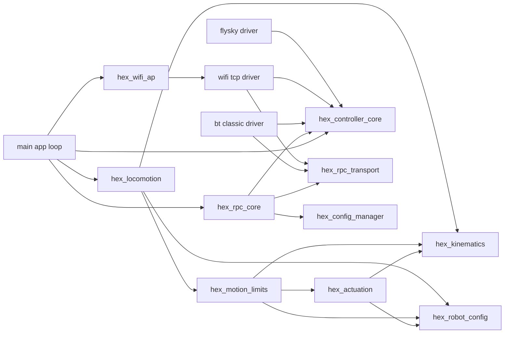

<div align="center">

# Hexapod Locomotion Framework (ESP32)

| Supported Targets | ESP32 |
| ----------------- | ----- |

</div>

## 1. Project Overview
This repository contains firmware for a fully custom 6‑leg (hexapod) walking robot built around an ESP32 using the ESP‑IDF framework. The code implements a modular locomotion stack: user command capture → gait phase scheduling → swing trajectory generation → whole body inverse kinematics → KPP motion limiting/state estimation → servo actuation. All mechanical parts are custom designed and 3D printed.

Facts:
- Architecture design inspired by [Efficient gait generation and evaluation for hexapod robots (2024)](https://cjme.springeropen.com/articles/10.1186/s10033-024-01000-0)
- I burned three ESP32 dev boards during development and counting
- Project eaten up 2 months of my life up to the first release and working stage

Documentation:
- Consolidated technical docs live in [docs/README.md](docs/README.md).

### Effort Summary

| Effort Area | Scope | Current Status | Notes |
| --- | --- | --- | --- |
| Locomotion Pipeline | Command mapping, gait scheduler, swing trajectory, whole-body IK | Implemented | Running in 100 Hz main loop with modular component split |
| KPP Motion Limits | Jerk/accel/velocity limiting and state estimation | Implemented | Integrated into control loop with persisted `motion_lim` runtime config |
| Controller Abstraction | Driver-agnostic core + transport-specific drivers | Implemented | FlySky, Bluetooth Classic, and WiFi TCP paths available |
| RPC System | Queue-based command processing and config control API | Implemented (core), expanding (commands) | Multi-transport routing active; advanced control commands still planned |
| Configuration Persistence | NVS namespaces, defaults, migration, typed access APIs | Implemented (foundation), expanding (coverage) | Namespaces include `system`, `joint_cal`, `leg_geom`, `motion_lim`, `controller`, `wifi` |
| Configurator / UX Tooling | Betaflight-style tuning portal and live telemetry UX | Planned | Protocol and backend groundwork in place; UI remains future work |

## 2. Hardware Summary
* MCU / Control: ESP32 module (classic dual‑core variant) running FreeRTOS via ESP‑IDF
* Servos: 18 × high‑torque 35 kg.cm hobby servos (3 DOF per leg: coxa yaw, femur pitch, tibia)
* Power Architecture:
  * Main source: 4S LiPo battery
  * Each pair of legs (i.e. 6 servos) is powered by its own dedicated 20A UBEC (3 UBECs total for locomotion load distribution)
  * Logic / ESP32 / auxiliary electronics powered by a separate UBEC for isolation and brown‑out resilience
* Signal Driving:
  * Mixed use of MCPWM and LEDC peripherals to reach 18 PWM outputs on classic ESP32
  * Dynamic allocation strategy reuses MCPWM operators/generators and assigns some legs to LEDC channels
* Mechanical Structure: All joints, brackets, and chassis components are custom 3D printed (CAD‑designed) around standardized servo sizes and link lengths.

## 3. Mechanical & Kinematic Model
Each leg provides 3 degrees of freedom:
1. Coxa (yaw / horizontal rotation, establishing lateral reach)
2. Femur (pitch / vertical-plane lift)
3. Tibia (distal pitch / extension)

Nominal link lengths (meters) from `robot_config.c`:
* Coxa: 0.068 m
* Femur: 0.088 m
* Tibia: 0.127 m

Coordinate Frames:
* Body frame: X forward (+), Y left (+), Z up (+)
* Leg-local frame: X outward (+), Y forward (+), Z up (+) for planning; internally the IK expects Z downward in some comments but is reconciled via transforms in `components/hex_locomotion/whole_body_control.c`.

Mount poses (per leg) define (x, y, z, yaw) to rotate body-frame targets into leg-local coordinates. Yaw is ±90° plus minor angular offsets to create a symmetric stance.

## 4. Software Architecture
Compact component overview:



High-level data flow (single control task loop at 100 Hz / 10 ms):

1. `user_command_poll()` (in `components/hex_locomotion/user_command.c`)
	* Reads latest decoded RC controller state (`components/hex_controller_core/controller.c`) over FlySky iBUS via UART.
	* Produces normalized user command structure (`user_command_t`). Includes gait selection, enable flag, velocity command, body height, lateral offset, terrain mode, step scaling.
2. `gait_scheduler_update()` (in `components/hex_locomotion/gait_scheduler.c`)
	* Maintains a continuous phase 0..1 and per‑leg support vs swing state based on selected gait (Tripod, Ripple, Wave) and commanded speed.
3. `swing_trajectory_generate()` (in `components/hex_locomotion/swing_trajectory.c`)
	* Converts gait phase + user motion/pose targets into desired foot positions in the body frame.
	* Uses cycloid‑like arcs for swing, linear pass for support, adjustable step length and clearance.
4. `whole_body_control_compute()` (in `components/hex_locomotion/whole_body_control.c`)
	* Transforms each foot target from body frame into its corresponding leg-local frame using mount pose and yaw.
	* Solves per‑leg inverse kinematics (`leg_ik_solve()` from `components/hex_kinematics/leg.c`) to produce joint angles.
5. `kpp_apply_limits()` (in `components/hex_motion_limits/kpp_system.c`)
	* Applies jerk/acceleration/velocity limiting to desired joint commands.
6. `robot_execute()` (in `components/hex_actuation/robot_control.c`)
	* Maps joint angles (radians) into microsecond PWM pulses with calibration (limits, inversion, offsets) from `components/hex_robot_config/robot_config.c`.
	* Lazily initializes MCPWM / LEDC channels and updates compare or duty registers.
7. `kpp_update_state()` (in `components/hex_motion_limits/kpp_system.c`)
	* Updates state estimation from the original (pre-limited) command stream.

Supporting Modules:
* `components/hex_robot_config/robot_config.*` centralizes geometry, calibration, servo driver selection, GPIO mappings, and stance parameters.
* `components/hex_controller_core/controller.*` encapsulates channel state and decode helpers.
* `components/hex_kinematics/leg.*` provides pure kinematic modeling (opaque handle + IK solver) decoupled from hardware.
* `components/hex_motion_limits/kpp_config.h` contains KPP runtime-limit/filter constants.

### Main Loop (`main.c`)
The `gait_framework_main()` task sets a fixed timestep `dt=0.01f`, gathers user input, advances scheduler, generates trajectories, computes IK, applies KPP motion limits, commands servos, and updates KPP state from original commands. Timing uses `esp_timer_get_time()` plus `vTaskDelay()` to maintain cadence while yielding to other tasks.

### Concurrency & Timing
* Currently a single high-level control loop task drives all locomotion logic.
* Controller UART reception runs in its own FreeRTOS task created by `controller_init()`; shared channel data is protected by a mutex.
* Future expansion could move heavy IK or trajectory computation to a dedicated high-priority task if needed.

## 5. Gait System
Implemented gait types (selectable via RC switch):
* Tripod (`GAIT_TRIPOD`): Alternating two groups of three legs. Provides fastest, most stable dynamic movement baseline.
* Ripple (`GAIT_RIPPLE`): Two legs swing at a time in three staggered windows (pairs determined by index % 3). Smoother COG shift.
* Wave (`GAIT_WAVE`): Single-leg swing progression for maximum static stability at lower speed.

Inspiration / References:
* Elements of phase grouping, stability considerations, and prospective optimization directions are informed by the research article: Efficient gait generation and evaluation for hexapod robots (2024) – https://cjme.springeropen.com/articles/10.1186/s10033-024-01000-0. The current implementation is a simplified, real‑time friendly subset and will evolve toward more quantitative energy/stability metrics.

Scheduler Logic:
* Maintains a normalized phase; frequency scaled by commanded forward velocity magnitude and a user step scaling knob.
* Determines each leg’s support/swing state, which the trajectory generator uses to choose stance vs swing profile.

Trajectory Highlights:
* Step length modulated by speed magnitude × user step_scale.
* Clearance height boosted when `terrain_climb` is active.
* Lateral body shift and vertical body height mapped from normalized inputs to meter ranges (configurable constants inside `swing_trajectory_init`).
* Uses proportion S of the phase cycle for swing (0<S<1) depending on gait (Tripod=0.5, Ripple≈0.33, Wave≈0.1).

## 6. Servo Control Strategy (18 PWM on ESP32)
Classic ESP32 has limited MCPWM operator capacity. This design:
* Reuses MCPWM timers/operators across channels (group pooling) to produce up to 12 channels.
* Assigns remaining joints to LEDC (50 Hz, 15-bit resolution) achieving additional PWM outputs.
* Calibration struct `joint_calib_t` defines per-joint direction (`invert_sign`), angle limits, and PWM µs mapping (default 500–2500 µs range, neutral 1500 µs).
* Lazy initialization ensures only needed peripherals are configured.

## 7. Development Environment
* IDE: Visual Studio Code with the official ESP‑IDF extension / environment.
* Build System: CMake generated by ESP‑IDF; project root contains `CMakeLists.txt` and `main/CMakeLists.txt`.
* Typical workflow:
  1. Configure target and flash settings in ESP‑IDF extension.
  2. Build (`idf.py build`) and flash (`idf.py flash`).
  3. Monitor logs (`idf.py monitor`) for control loop timing, servo init, and controller connection messages.

## 7.1 Python Integration Tests

The repository includes host-side pytest integration tests for runtime command validation.

Install test dependencies:

```bash
pip install -r test/requirements.txt
```

Run general listing tests:

```bash
python -m pytest -q test/test_config_general_listing.py
```

If you see warnings like `PytestExperimentalApiWarning: record_xml_attribute is an experimental feature`, the `pytest-embedded` plugin is being auto-loaded in this environment. For host-side integration tests in `test/`, run pytest with that plugin disabled:

```bash
python -m pytest -q -p no:embedded test/test_config_general_listing.py
```

Notes:
* These tests are intended for Windows hosts and use `winwifi` to reuse current `HEXABOT_xxx` Wi-Fi or connect to the first discovered matching network.
* Override target endpoint if needed with environment variables: `HEXABOT_IP` and `HEXABOT_PORT`.

## 8. Visualization & Simulation
Complementary project for iterating on gait algorithms without hardware:
https://github.com/pgrudzien12/hexapod-visualizer

This external visualizer helps refine trajectory shapes, gait transitions, and future whole‑body control strategies before deployment on the physical robot.

## 9. Power & Safety Considerations
* Separate UBEC for logic prevents voltage sag from high servo load causing MCU resets.
* Distributing leg pairs across independent 20A UBECs reduces peak current concentration and wiring heating.
* RC arm/disarm switch (`enable` flag) prevents unintended motion during setup; when disabled, scheduler freezes and all legs remain in support state.
* Future: add soft-start ramp and watchdog to detect IK failures / out-of-reach foot targets.

## 10. Planned / Future Work
Short-term:
* Refine inverse kinematics limits and add reachability checks with graceful fallback per leg.
* Parameterize trajectory scaling (y range, height limits) via runtime configuration.

Mid-term:
* Modular controller input abstraction (initial implementation complete: FlySky iBUS driver + pluggable architecture for WiFi / BT).
* Web-based configuration interface (inspired by Betaflight) for tuning: servo calibration, gait parameters, stance geometry, safety thresholds.
* Persistent storage (NVS) for robot configuration instead of static initialization.
* Enhanced turning support: integrate yaw rate (`wz`) into per-leg lateral/forward offsets.

Long-term / Stretch:
* Add NVIDIA Jetson companion computer with stereoscopic depth camera for vision, terrain classification, and autonomous navigation (high-level planner sends velocity/pose commands to ESP32 locomotion layer).
* Terrain-adaptive foot placement (reactive height and lateral adjustment based on sensed surface). 
* State estimation fusing IMU and leg odometry.
* Energy-efficient gait optimization layer (multi-objective: power consumption vs stability vs speed), extending ideas from the referenced 2024 hexapod gait research to adapt duty factor and phase offsets on-the-fly.

## 11. Repository Structure (Key Files)
* `main/main.c` – Control loop entry point.
* `components/hex_locomotion/gait_scheduler.*` – Phase management & leg support/swing pattern logic.
* `components/hex_locomotion/swing_trajectory.*` – Foot trajectory generation from scheduler + user command.
* `components/hex_locomotion/whole_body_control.*` – Frame transforms & IK orchestration.
* `components/hex_locomotion/user_command.*` – Aggregates controller state into locomotion command.
* `components/hex_motion_limits/kpp_system.*` – KPP limiting and state estimation.
* `components/hex_motion_limits/kpp_forward_kin.c` – Forward kinematics for state estimation.
* `components/hex_motion_limits/kpp_config.h` – KPP limits/filter tuning constants.
* `components/hex_actuation/robot_control.*` – Joint angle to PWM mapping, peripheral management (MCPWM + LEDC).
* `components/hex_robot_config/robot_config.*` – Central configuration: geometry, calibration, mounts, driver selection.
* `components/hex_kinematics/leg.*` – Pure kinematic leg model & IK solver.
* `components/hex_controller_core/controller.*` – Controller abstraction and channel decoding.
* `components/hex_controller_driver_flysky_ibus/controller_flysky_ibus.c` – FlySky iBUS driver (UART task) feeding abstraction.

## 12. Getting Started (Build & Flash)
1. Install ESP‑IDF (v5.x recommended) and export environment.
2. Connect ESP32 over USB.
3. (Optional) Edit GPIO mappings / driver selections in `components/hex_robot_config/robot_config.c` before first flash.
4. Build & flash.
5. Power servos from their UBECs only after confirming logic supply is stable.

## 13. Notes on Customization
* Adjust leg geometry: change lengths in `leg_geometry_t` initialization before calling `leg_configure()`.
* Tune servo mappings: update `joint_calib_t` ranges & neutral offsets in `robot_config_init_default()`.
* Tune KPP limits/filters in `components/hex_motion_limits/kpp_config.h`.
* Add new gait: extend `gait_type_t`, expand switch in `gait_scheduler_update()` and adapt `swing_trajectory_generate()` for phase offset logic.

### Controller Abstraction & Future Runtime Swapping

The controller layer now provides a driver abstraction. Key points:

* Each driver spins a FreeRTOS task ingesting raw input (UART, TCP socket, Bluetooth) then updates a shared signed channel array (32 × int16_t, range -32768..32767) guarded by a mutex.
* Existing APIs `controller_get_channels()` and `controller_decode()` remain stable; locomotion stack is transport‑agnostic.
* Failsafe injects neutral (zero) channels when a driver times out or disconnects.
* Current driver: FlySky iBUS over UART (default) – its 1000..2000 values are rescaled into full signed range for first 14 slots; remaining slots zero.
* WiFi TCP driver (added): versioned binary frame (74 bytes) with sync (AA55), header, 32 signed channels, CRC16.
	* Detailed spec: see [docs/WIFI_TCP_PROTOCOL.md](docs/WIFI_TCP_PROTOCOL.md).
	* Current network mode: AP-only for simplicity (see [docs/WIFI_NETWORK_MODES.md](docs/WIFI_NETWORK_MODES.md) for evolution plan to AP+STA).
	* AP SSID generation supports fixed, MAC-suffix, or random-suffix modes (default = MAC suffix, e.g. `HEXAPOD_AP_3AF2B7`).
* Opaque driver configuration: `controller_config_t` holds a `driver_cfg` pointer + size (e.g. `controller_flysky_ibus_cfg_t`). This keeps core lean while enabling WiFi / BT specific parameters. Memory ownership is with caller.
* Developer guide for writing new drivers: see [docs/CONTROLLER_DRIVERS.md](docs/CONTROLLER_DRIVERS.md).
* (Early draft WiFi packet format removed; see [docs/WIFI_TCP_PROTOCOL.md](docs/WIFI_TCP_PROTOCOL.md) for the authoritative current definition.)

Runtime selection (future): store selected driver + params (e.g. WiFi port, BT service UUID) in NVS, applied at boot so firmware can remain static while changing control sources from the portal.

## 14. License
This project is licensed under the Apache License, Version 2.0. See the `LICENSE` file at the repository root for the full text.

Include the following notice in derivative works:

```
Copyright 2025 Paweł Grudzień

Licensed under the Apache License, Version 2.0 (the "License");
you may not use this file except in compliance with the License.
You may obtain a copy of the License at

	http://www.apache.org/licenses/LICENSE-2.0

Unless required by applicable law or agreed to in writing, software
distributed under the License is distributed on an "AS IS" BASIS,
WITHOUT WARRANTIES OR CONDITIONS OF ANY KIND, either express or implied.
See the License for the specific language governing permissions and
limitations under the License.
```

Some source files retain original ESP‑IDF Apache 2.0 headers; new modules follow the same license.

---
If you build upon this project, a link back or a star is appreciated. Contributions (PRs) for new gaits, better IK, or configuration UI are welcome.


