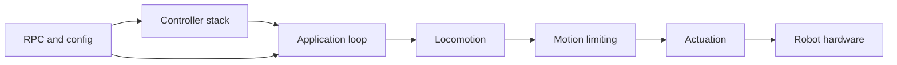

<div align="center">

# Hexapod Locomotion Framework (ESP32)

| Supported Targets | ESP32 |
| ----------------- | ----- |

</div>

## Overview

This repository contains ESP-IDF firmware for a custom 6-legged walking robot built on ESP32. The firmware is organized as a set of explicit components covering locomotion, motion limiting, actuation, controller ingestion, RPC, Wi-Fi/Bluetooth transport, and persistent runtime configuration.

The project goal is not only to make the robot walk, but to keep the stack inspectable and tunable: runtime parameters are namespace-based, transport ingress is modular, and the control loop stays centered around a predictable 100 Hz pipeline.

## Facts

- Architecture design inspired by [Efficient gait generation and evaluation for hexapod robots (2024)](https://cjme.springeropen.com/articles/10.1186/s10033-024-01000-0)
- I burned three ESP32 dev boards during development and counting
- The first working release took roughly two months of design, firmware integration, and hardware bring-up work

## Effort Summary

| Effort Area | Scope | Current Status | Notes |
| --- | --- | --- | --- |
| Locomotion Pipeline | Command mapping, gait scheduler, swing trajectory, whole-body IK | Implemented | Runs in a fixed 100 Hz control loop |
| KPP Motion Limits | Velocity, acceleration, jerk limiting and state estimation | Implemented | Runtime limits are configuration-backed |
| Controller Abstraction | Driver-agnostic core plus transport-specific drivers | Implemented | FlySky, Wi-Fi TCP, and Bluetooth Classic paths are present |
| RPC System | Queue-based command processing and config control | Implemented | Live inspection and runtime tuning are available |
| Configuration Platform | Namespace defaults, migration, discovery, persistence | Implemented | Core runtime namespaces are already consumed by modules |
| Configurator Tooling | External tuning and visualization UX | Planned | Firmware-side groundwork exists; UI work remains |

## Hardware Snapshot

- MCU: ESP32 running FreeRTOS through ESP-IDF.
- Robot layout: 6 legs, 3 degrees of freedom per leg, 18 hobby servos total.
- Power architecture: 4S LiPo with separate UBEC paths for locomotion power and logic power isolation.
- PWM strategy: mixed MCPWM and LEDC usage to reach all 18 outputs on classic ESP32.
- Mechanical structure: custom 3D-printed chassis, brackets, and leg parts built around standardized servo geometry.

## Mechanical Model

- Leg joints: coxa yaw, femur pitch, tibia pitch.
- Nominal link lengths: coxa `0.068 m`, femur `0.088 m`, tibia `0.127 m`.
- Body frame convention: `+X` forward, `+Y` left, `+Z` up.
- Per-leg mount poses rotate body-frame targets into leg-local coordinates before inverse kinematics.

## High-Level Architecture



- Controller stack: receives operator input from supported transports and normalizes it.
- RPC and config: handles runtime commands, parameter discovery, persistence, and save flows.
- Application loop: owns boot order and the 100 Hz control cycle.
- Locomotion: turns operator intent into gait phase, foot targets, and joint-space commands.
- Motion limiting: constrains commanded motion to configured dynamic envelopes.
- Actuation: maps joint commands to the PWM outputs that drive the robot.

## What Is In Place

- Modular locomotion pipeline: command mapping, gait scheduling, swing generation, whole-body IK, KPP limiting, and servo actuation.
- Multi-transport control stack with FlySky iBUS, Wi-Fi TCP, and Bluetooth Classic component boundaries.
- RPC command path for live inspection and parameter updates.
- Persistent configuration platform with namespace-backed defaults, migration, discovery, and save flows.
- Host-side pytest integration tests for RPC/config validation.

## Repository Shape

- `main/`: bootstrapping and top-level task orchestration.
- `components/`: runtime system split into ESP-IDF components.
- `docs/`: architecture, configuration, protocol, and planning documentation.
- `test/`: host-side integration tests for runtime command and config behavior.

## Start Here

- Documentation hub: [docs/README.md](docs/README.md)
- System architecture: [docs/architecture/SYSTEM_ARCHITECTURE.md](docs/architecture/SYSTEM_ARCHITECTURE.md)
- Development setup: [docs/development/README.md](docs/development/README.md)
- Hardware and mechanics: [docs/architecture/HARDWARE_AND_MECHANICS.md](docs/architecture/HARDWARE_AND_MECHANICS.md)
- RPC and transport docs: [docs/interfaces/RPC_USER_GUIDE.md](docs/interfaces/RPC_USER_GUIDE.md)
- Configuration persistence design: [docs/configuration/CONFIGURATION_PERSISTENCE_DESIGN.md](docs/configuration/CONFIGURATION_PERSISTENCE_DESIGN.md)

## Build And Flash

1. Install ESP-IDF 5.x and export the environment.
2. Build the firmware with `idf.py build`.
3. Flash the target with `idf.py flash`.
4. Monitor logs with `idf.py monitor`.

## Host-Side Integration Tests

Install dependencies:

```bash
pip install -r test/requirements.txt
```

Run a focused test file:

```bash
python -m pytest -q -p no:embedded test/test_config_general_listing.py
```

The tests are written for Windows hosts and connect to a live robot endpoint over Wi-Fi.

## Additional Context

- Technical documentation lives under [docs/README.md](docs/README.md).
- A companion gait visualization project exists at <https://github.com/pgrudzien12/hexapod-visualizer>.
- The work is informed in part by the 2024 paper *Efficient gait generation and evaluation for hexapod robots*.

## License

Apache License 2.0. See [LICENSE](LICENSE).

This project is licensed under the Apache License, Version 2.0. See the `LICENSE` file at the repository root for the full text.

Include the following notice in derivative works:

```
Copyright 2025 Paweł Grudzień

Licensed under the Apache License, Version 2.0 (the "License");
you may not use this file except in compliance with the License.
You may obtain a copy of the License at

	http://www.apache.org/licenses/LICENSE-2.0

Unless required by applicable law or agreed to in writing, software
distributed under the License is distributed on an "AS IS" BASIS,
WITHOUT WARRANTIES OR CONDITIONS OF ANY KIND, either express or implied.
See the License for the specific language governing permissions and
limitations under the License.
```

Some source files retain original ESP‑IDF Apache 2.0 headers; new modules follow the same license.

---
If you build upon this project, a link back or a star is appreciated. Contributions (PRs) for new gaits, better IK, or configuration UI are welcome.


