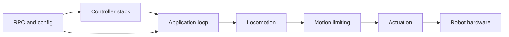

# Hexapod

An ESP32-powered hexapod robot built as a long-term robotics and embedded systems project.

The goal is not just to make a robot walk, but to learn and at the same time build a platform that is easy to experiment with, tune, and extend. Most robot behavior is configurable at runtime, control inputs are transport-independent, and the motion stack is organized into separated components.

The project combines firmware, hardware design, and system documentation in a single repository.

> Current platform: 6 legs, 18 servos, ESP32, ESP-IDF, FreeRTOS.

---

## What Is In This Repository

The repository contains software and hardware assets used to develop and validate the robot.

```text
firmware/
├── mainboard/     Main robot firmware
└── leg_v2/        Experimental leg-controller workspace

docs/              Architecture and design documentation
hardware/          Electronics and mechanical design files
```

Mainboard firmware overview: [firmware/mainboard/README.md](firmware/mainboard/README.md)

The main firmware is built around a fixed 100 Hz control loop and a modular motion pipeline:

```text
Controller Input
        ↓
Gait Scheduler
        ↓
Foot Trajectory Generation
        ↓
Inverse Kinematics
        ↓
Motion Limiting
        ↓
Servo Outputs
```

---

## Current Technical Highlights

## Effort Summary

| Effort Area | Scope | Current Status | Notes |
| --- | --- | --- | --- |
| Locomotion Pipeline | Command mapping, gait scheduler, swing trajectory, whole-body IK | Implemented | Runs in a fixed 100 Hz control loop |
| KPP Motion Limits | Velocity, acceleration, jerk limiting and state estimation | Implemented | Runtime limits are configuration-backed |
| Controller Abstraction | Driver-agnostic core plus transport-specific drivers | Implemented | FlySky iBUS, Wi-Fi TCP, and Bluetooth Classic paths are present |
| RPC System | Queue-based command processing and config control | Implemented | Live inspection and runtime tuning are available |
| Configuration Platform | Namespace defaults, migration, discovery, persistence | Implemented | Core runtime namespaces are already consumed by modules |
| Configurator Tooling | External tuning and visualization UX | Planned | Firmware-side groundwork exists; UI work remains |

## Hardware Snapshot

- MCU: ESP32 running FreeRTOS through ESP-IDF.
- Robot layout: 6 legs, 3 degrees of freedom per leg, 18 hobby servos total.
- Power architecture: 4S LiPo with separate UBEC paths for locomotion power and logic power isolation.
- PWM strategy: mixed MCPWM and LEDC usage to reach all 18 outputs on classic ESP32.
- Mechanical structure: custom 3D-printed chassis, brackets, and leg parts built around standardized servo geometry.

## High-Level Architecture



- Controller stack: receives operator input from supported transports and normalizes it.
- RPC and config: handles runtime commands, parameter discovery, persistence, and save flows.
- Application loop: owns boot order and the 100 Hz control cycle.
- Locomotion: turns operator intent into gait phase, foot targets, and joint-space commands.
- Motion limiting: constrains commanded motion to configured dynamic envelopes.
- Actuation: maps joint commands to the PWM outputs that drive the robot.

### Runtime Configuration

Configuration is treated as a first-class subsystem rather than a collection of compile-time constants.

Parameters are organized into namespaces. Each namespace owns:

- parameter definitions,
- default values,
- validation rules,
- persistence behavior,
- migration logic,
- RPC discovery metadata.

The configuration manager provides:

- runtime parameter inspection,
- runtime modification,
- save/load operations,
- namespace registration,
- NVS persistence,
- version-aware migration support.

Robot geometry, calibration data, controller settings, motion limits, and other runtime behavior are loaded through this system rather than being hardcoded throughout the codebase.

### Motion Pipeline

The locomotion stack converts user commands into joint targets through a sequence of dedicated subsystems:

- gait scheduling,
- swing trajectory generation,
- inverse kinematics,
- velocity limiting,
- acceleration limiting,
- jerk limiting,
- servo actuation.

The motion loop runs at 100 Hz.

### Controller Abstraction

Controller transports are separated from locomotion.

Supported ingress paths currently include:

- FlySky iBUS,
- Wi-Fi TCP,
- Bluetooth Classic.

Each transport driver translates incoming data into a normalized controller state consumed by the motion system.

This allows locomotion, gait generation, and motion limiting to remain independent of transport-specific protocols.

### Hardware-Aware Design

The robot uses 18 servos arranged as three joints per leg:

- Coxa
- Femur
- Tibia

Servo signal generation is implemented on ESP32 using a combination of MCPWM and LEDC peripherals to fit within available hardware resources.

Power for logic and servos is separated to improve stability under heavy load.

---

## Engineering Problems Being Explored

This project is primarily a learning and engineering platform.

Current focus areas include:

- real-time control on resource-constrained hardware,
- gait generation and scheduling,
- inverse kinematics,
- motion smoothing and trajectory constraints,
- configuration architecture for embedded systems,
- transport-independent control interfaces,
- robotics software maintainability,
- practical servo-driven locomotion.

---

## Future Hardware Revisions

Several areas are currently being explored for a future hardware revision.

### Mechanical

- Larger body volume for easier electronics integration.
- Improved cable routing.
- Increased structural stiffness in the legs.
- Better serviceability and assembly.

### Electronics

- Separation of control and power-distribution responsibilities.
- Dedicated power board for servo power routing.
- Simplified mainboard focused on control and communication.

### Distributed Leg Control

One architecture under investigation places a microcontroller in each leg.

The current concept is:

- Main controller performs locomotion and planning.
- Leg controllers generate local PWM signals.
- Communication occurs over a shared bus.
- Current sensing and additional sensors can be integrated at the leg level.

The architecture is intended to reduce wiring complexity and make future sensor integration easier.

---

## Documentation

The repository contains detailed documentation covering implementation details and architecture decisions.

Recommended starting points:

- Mainboard firmware documentation: [firmware/mainboard/README.md](firmware/mainboard/README.md)
- System architecture: [docs/architecture/SYSTEM_ARCHITECTURE.md](docs/architecture/SYSTEM_ARCHITECTURE.md)
- Configuration system: [docs/configuration/CONFIGURATION_PERSISTENCE_DESIGN.md](docs/configuration/CONFIGURATION_PERSISTENCE_DESIGN.md)
- RPC interface documentation: [docs/interfaces/RPC_USER_GUIDE.md](docs/interfaces/RPC_USER_GUIDE.md)
- Hardware and mechanics overview: [docs/architecture/HARDWARE_AND_MECHANICS.md](docs/architecture/HARDWARE_AND_MECHANICS.md)

Documentation map: [docs/README.md](docs/README.md)

---

## Project Status

The project is under active development.

Current work focuses on improving locomotion quality, refining control architecture boundaries, and preparing the next generation of leg electronics while keeping the existing robot operational as a test platform.

---

## License

This repository uses Apache License 2.0 for the mainboard firmware.

License file location: [LICENSE](LICENSE)

Include the following notice in derivative works:

```text
Copyright 2025 Pawel Grudzien

Licensed under the Apache License, Version 2.0 (the "License");
you may not use this file except in compliance with the License.
You may obtain a copy of the License at

    http://www.apache.org/licenses/LICENSE-2.0

Unless required by applicable law or agreed to in writing, software
distributed under the License is distributed on an "AS IS" BASIS,
WITHOUT WARRANTIES OR CONDITIONS OF ANY KIND, either express or implied.
See the License for the specific language governing permissions and
limitations under the License.
```
