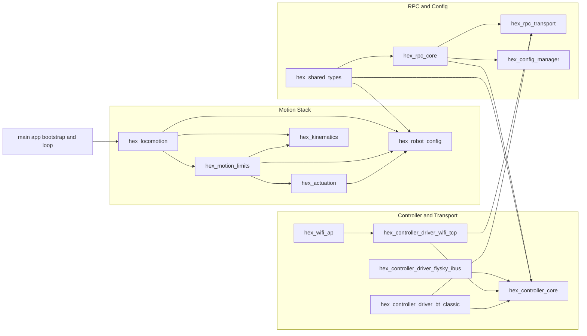
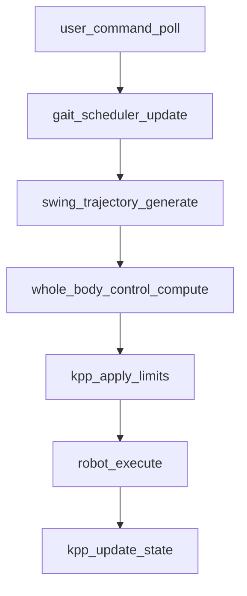
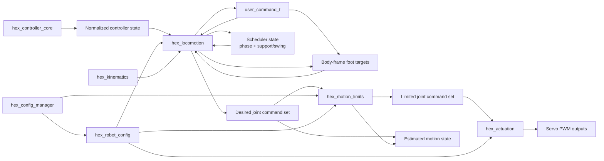
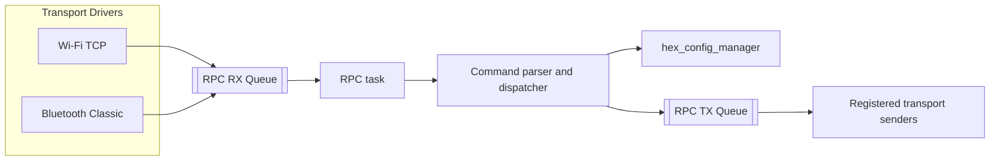

# Hexapod System Architecture

## Purpose

This document is the current-state architecture reference for the firmware in this repository.

It describes:
- which ESP-IDF components make up the system,
- how data moves through the runtime,
- where configuration and transport boundaries live,
- which architectural rules are expected to remain stable.

## 1. System At A Glance

The firmware is split into explicit ESP-IDF components under `components/`, with `main/` responsible for top-level boot ordering and task orchestration.

## 2. Architectural Layers

### 2.1 Application Bootstrap

Owned by `main/`.

Responsibilities:
- initialize configuration and persistent storage access,
- start RPC and transport-facing services,
- initialize robot runtime dependencies,
- run the fixed-step locomotion loop.

This layer wires components together but should avoid re-implementing component logic.

### 2.2 Motion Stack

The motion stack converts a normalized user command into limited servo outputs.

Components:
- `hex_locomotion`: user command mapping, gait scheduling, swing target generation, whole-body control.
- `hex_motion_limits`: KPP-based velocity, acceleration, and jerk limiting plus state estimation.
- `hex_actuation`: joint command to PWM output translation and peripheral driving.
- `hex_kinematics`: math-only leg kinematics primitives.
- `hex_robot_config`: geometry, mount pose, joint calibration, and servo mapping consumption.

Design intent:
- `hex_kinematics` stays hardware-agnostic.
- `hex_actuation` is the only layer that touches servo driver peripherals.
- `hex_robot_config` projects namespace-backed runtime configuration into motion consumers.

### 2.3 Controller And Transport Stack

This stack decouples controller transport details from locomotion.

Components:
- `hex_controller_core`: normalized channel state, connection state, failsafe behavior, and decode helpers.
- `hex_controller_driver_flysky_ibus`: FlySky ingress.
- `hex_controller_driver_wifi_tcp`: Wi-Fi TCP ingress and RPC forwarding.
- `hex_controller_driver_bt_classic`: Bluetooth Classic ingress and RPC forwarding.
- `hex_wifi_ap`: Wi-Fi AP bring-up and naming policy.

Design intent:
- locomotion reads normalized controller state only,
- transport drivers never call motion modules directly,
- transport-specific framing stays at the driver edge.

### 2.4 RPC And Configuration Stack

This stack owns text command ingress, parameter discovery, persistence, and save flows.

Components:
- `hex_rpc_transport`: transport-neutral RX/TX queueing and sender registration.
- `hex_rpc_core`: parser, dispatcher, and runtime command handling.
- `hex_config_manager`: namespace registry, defaults, validation, load/save, migration, and NVS persistence.
- `hex_shared_types`: cross-component enums and shared structs.

Design intent:
- RPC should operate through public service APIs, not transport internals.
- configuration defaults and persistence behavior should have a single authoritative definition.
- runtime consumers should fail fast when required namespace-backed configuration is unavailable instead of silently falling back to hidden local defaults.

## 3. Runtime Flows

### 3.1 Boot Flow

Boot sequence at a high level:

1. Initialize configuration manager and make namespace state available.
2. Start RPC transport/core services.
3. Bring up Wi-Fi AP and transport-facing controller services as configured.
4. Initialize robot runtime modules that consume loaded configuration.
5. Enter the periodic locomotion loop.

The important architectural point is ordering: configuration and communication services come up before consumers that depend on namespace-backed runtime values.

### 3.2 10 ms Locomotion Loop Execution Flow

The main control loop runs at 100 Hz and follows a single dominant pipeline:

Per-stage role:

1. `user_command_poll` reads normalized controller state and produces `user_command_t`.
2. `gait_scheduler_update` advances phase and support/swing state.
3. `swing_trajectory_generate` produces body-frame foot targets.
4. `whole_body_control_compute` transforms targets into leg-local frames and solves IK.
5. `kpp_apply_limits` constrains joint commands to configured motion envelopes.
6. `robot_execute` maps commands to servo outputs.
7. `kpp_update_state` updates estimated motion state from the command stream.

### 3.3 10 ms Locomotion Loop Information Flow

The same control loop can also be viewed as a data-transformation pipeline. In this view, the important question is not only what runs next, but which runtime state each stage consumes and which outputs it produces.

Data-flow interpretation:

1. `hex_controller_core` exposes normalized controller state, which `user_command_poll` converts into `user_command_t`.
2. `gait_scheduler_update` consumes the user command and produces scheduler phase plus support/swing state.
3. `swing_trajectory_generate` consumes the user command and scheduler state to produce body-frame foot targets.
4. `whole_body_control_compute` consumes foot targets together with robot geometry and mount data from `hex_robot_config`, and kinematic solving support from `hex_kinematics`, to produce the desired joint command set.
5. `kpp_apply_limits` consumes desired joint commands together with runtime limit configuration to produce the limited joint command set.
6. `robot_execute` consumes the limited joint command set together with projected robot configuration to produce the actual PWM outputs.
7. `kpp_update_state` derives estimated motion state from the command stream after the loop update.

### 3.4 RPC And Config Flow

RPC and persistence are queue-oriented and transport-neutral.

This keeps command semantics centralized even when multiple ingress paths exist.

## 4. Component Ownership Summary

### Motion And Robot Behavior

- `hex_locomotion`: high-level motion intent to desired body/leg targets.
- `hex_motion_limits`: dynamic command conditioning and state estimation.
- `hex_actuation`: hardware-facing servo output generation.
- `hex_kinematics`: reusable leg math.
- `hex_robot_config`: geometry, mounts, calibration, and servo map projection.

### Input, Transport, And Control

- `hex_controller_core`: canonical controller state and decode path.
- `hex_controller_driver_*`: transport-specific ingress and forwarding.
- `hex_wifi_ap`: Wi-Fi service availability.

### RPC, Configuration, And Shared Contracts

- `hex_rpc_transport`: transport-neutral queues and sender plumbing.
- `hex_rpc_core`: command handling and operational RPC behavior.
- `hex_config_manager`: namespace-based configuration platform.
- `hex_shared_types`: shared enums/types that should not be duplicated across components.

## 5. Dependency Rules

These rules define the expected architecture boundary and are more important than exact file placement.

- Motion components must not depend on transport-specific controller drivers.
- Transport drivers must not call locomotion modules directly.
- Hardware peripheral access for servo output belongs in `hex_actuation`, not in locomotion or kinematics.
- Kinematics code should remain usable without hardware dependencies.
- RPC command handling should rely on public controller/config APIs rather than internal transport details.
- Shared enums and cross-component data contracts should live in `hex_shared_types` or the owning public component, not in duplicated private headers.

## 6. Configuration Architecture Position

Configuration is not an auxiliary subsystem; it is part of the runtime contract.

Current architectural stance:
- runtime-tunable data belongs to named configuration namespaces,
- namespace defaults are the single source of truth for their domains,
- persistence and migration are owned by `hex_config_manager`,
- consuming components load and validate the configuration they require,
- missing required config should surface as an initialization/runtime fault rather than trigger silent local fallback behavior.

See [../configuration/CONFIGURATION_PERSISTENCE_DESIGN.md](../configuration/CONFIGURATION_PERSISTENCE_DESIGN.md) for storage and lifecycle details.

## 7. Documentation Map

Use the following docs together with this one:

- Configuration model: [../configuration/CONFIGURATION_PERSISTENCE_DESIGN.md](../configuration/CONFIGURATION_PERSISTENCE_DESIGN.md)
- Namespace authoring template: [../configuration/CONFIG_MANAGER_NAMESPACE_TEMPLATE.md](../configuration/CONFIG_MANAGER_NAMESPACE_TEMPLATE.md)
- RPC operational guide: [../interfaces/RPC_USER_GUIDE.md](../interfaces/RPC_USER_GUIDE.md)
- RPC contract and command semantics: [../interfaces/RPC_SYSTEM_DESIGN.md](../interfaces/RPC_SYSTEM_DESIGN.md)
- Controller and transport details: [../interfaces/CONTROLLER_DRIVERS.md](../interfaces/CONTROLLER_DRIVERS.md)
- Historical refactor context: [../archive/CONFIG_MANAGER_ARCHITECTURE_REVIEW.md](../archive/CONFIG_MANAGER_ARCHITECTURE_REVIEW.md)

## 8. What This Document Does Not Cover

This document intentionally does not duplicate:
- mechanical design details,
- per-parameter configuration tables,
- transport packet examples already covered in protocol docs,
- forward-looking refactor plans and migration phase tracking.

Those concerns live in their dedicated documents so that this file can remain the authoritative architecture reference.
