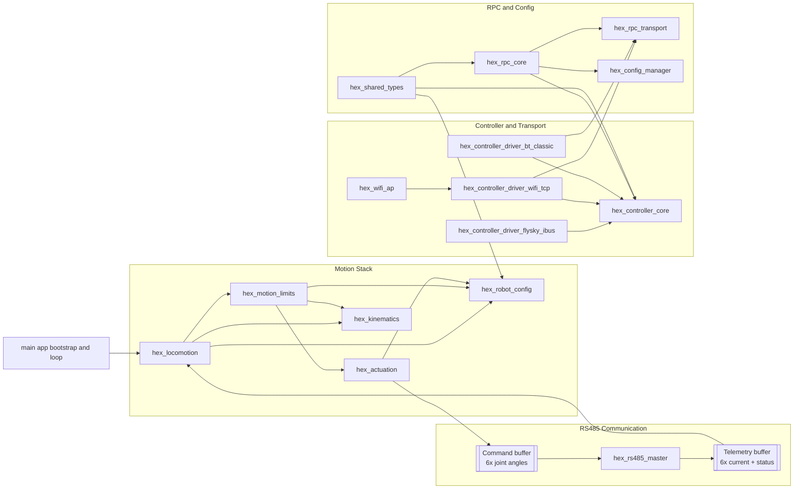
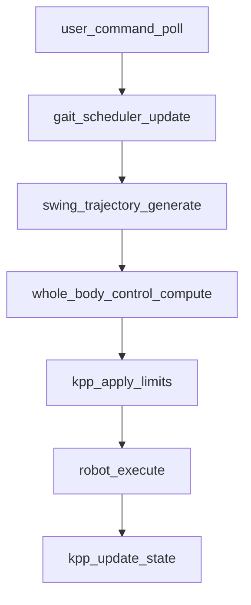
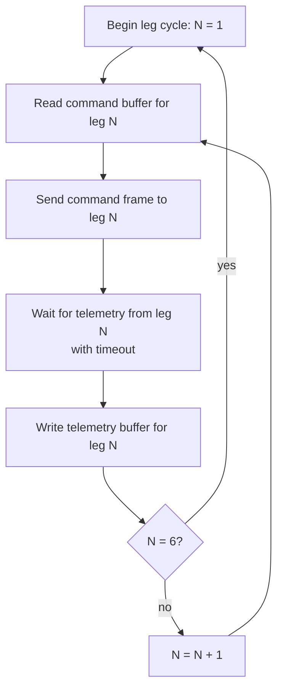
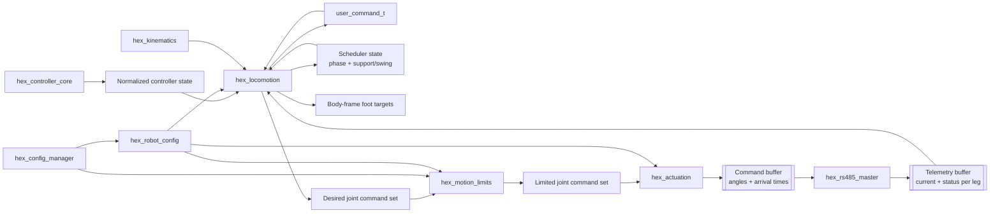

# Hexapod V2 System Architecture

## Purpose

This document is the firmware architecture reference for Version 2.

It describes:
- which firmware components make up the V2 system,
- what changed from V1 and why,
- how data moves through the runtime,
- how the RS485 communication task decouples leg communication from the motion loop.

For hardware topology, power distribution, and board responsibilities see
[HARDWARE_AND_MECHANICS.md](HARDWARE_AND_MECHANICS.md).

---

## What Differs From V1

V2 firmware is structurally identical to V1 with one significant addition: the
motion stack no longer drives servo hardware directly. Instead `hex_actuation`
writes desired joint angles to a shared command buffer, and a new
`hex_rs485_master` component owns a dedicated FreeRTOS task that sends those
angles to the six RP2040 leg controllers and immediately polls telemetry back
from each leg — all without blocking the 100 Hz locomotion loop.

Everything else — controller and transport stack, RPC and configuration stack,
gait scheduling, kinematics, motion limiting — is unchanged from V1.

---

## 1. System At A Glance



---

## 2. Architectural Layers

### 2.1 Application Bootstrap

Owned by `main/`. Identical to V1 with one additional responsibility: initialize
`hex_rs485_master` and start the RS485 communication task before entering the
locomotion loop.

### 2.2 Motion Stack

The motion stack is identical to V1 through `kpp_apply_limits`. The only change
is in `hex_actuation`.

Components:
- `hex_locomotion`: user command mapping, gait scheduling, swing target
  generation, whole-body control. Unchanged from V1.
- `hex_motion_limits`: KPP-based velocity, acceleration, and jerk limiting plus
  state estimation. Unchanged from V1.
- `hex_actuation`: converts limited joint commands to wire format and writes
  them to the shared command buffer. Returns immediately — no bus I/O, no
  blocking. Same public API as V1; V2 implementation swaps PWM register writes
  for command buffer writes.
- `hex_kinematics`: math-only leg kinematics primitives. Unchanged from V1.
- `hex_robot_config`: geometry, mount pose, joint calibration, and servo mapping
  consumption. Unchanged from V1.

Design intent:
- No component in the motion stack touches the RS485 bus or blocks on leg
  communication.
- `hex_actuation` keeps the same public API as V1 so the rest of the motion
  stack requires no changes.

### 2.3 RS485 Communication Stack

New in V2. Owns the physical RS485 bus and all leg communication.

Components:
- `hex_rs485_master`: dedicated FreeRTOS task; owns the RS485 bus exclusively;
  executes a per-leg send-and-poll cycle; writes results to the telemetry
  buffer.
- **Command buffer**: shared memory written by `hex_actuation` (main loop) and
  read by `hex_rs485_master` (comm task). Holds desired joint angles and arrival
  times for all six legs. The comm task always reads the latest written value;
  writes from the main loop are non-blocking.
- **Telemetry buffer**: shared memory written by `hex_rs485_master` (comm task)
  and read by motion stack consumers. Holds the latest available per-leg
  telemetry (per-servo current, leg status). May be up to one comm cycle stale.

Per-leg transaction (executed by `hex_rs485_master` for each leg in sequence):

```
1. Read desired angles for leg N from command buffer.
2. Assert DE high — transmit mode.
3. Send command frame to leg N (desired joint angles + arrival time).
4. Release DE low — receive mode.
5. Wait for telemetry response from leg N (per-servo current + leg status).
6. Write telemetry to buffer entry for leg N.
```

This repeats for legs 1 through 6, then immediately restarts. The telemetry
buffer entry for each leg is updated as soon as its transaction completes — the
main loop does not need to wait for all six legs before any result is available.

Design intent:
- The RS485 bus is owned exclusively by `hex_rs485_master`. No other component
  asserts DE or writes to the bus.
- Send and poll are a single transaction per leg so current measurements are as
  fresh as the bus cycle allows. This is the minimum possible latency for
  detecting leg touchdown from a current spike.
- A single leg timing out must not stall the comm cycle. `hex_rs485_master`
  applies a per-leg response timeout and moves on to leg N+1.
- The comm task rate is determined by per-leg transaction time (baud rate, frame
  sizes, DE turnaround, leg response latency) and is independent of the 100 Hz
  main loop rate.

### 2.4 Controller And Transport Stack

Identical to V1. See
[../../common/interfaces/CONTROLLER_DRIVERS.md](../../common/interfaces/CONTROLLER_DRIVERS.md).

### 2.5 RPC And Configuration Stack

Identical to V1. See
[../../common/interfaces/RPC_SYSTEM_DESIGN.md](../../common/interfaces/RPC_SYSTEM_DESIGN.md)
and
[../../common/configuration/CONFIGURATION_PERSISTENCE_DESIGN.md](../../common/configuration/CONFIGURATION_PERSISTENCE_DESIGN.md).

---

## 3. Runtime Flows

### 3.1 Boot Flow

1. Initialize configuration manager and make namespace state available.
2. Start RPC transport/core services.
3. Bring up Wi-Fi AP and transport-facing controller services as configured.
4. Initialize robot runtime modules that consume loaded configuration.
5. Initialize `hex_rs485_master` and start the RS485 communication task.
6. Enter the 100 Hz locomotion loop.

RS485 initialization must complete before the locomotion loop starts so that the
comm task is running and the command buffer is being serviced from the first
loop cycle.

### 3.2 100 Hz Locomotion Loop

The pipeline is structurally identical to V1:



`robot_execute` (inside `hex_actuation`) writes desired joint angles and arrival
times to the command buffer and returns. The call never blocks on bus I/O.

Telemetry from the latest completed comm cycle is available in the telemetry
buffer at any point in the loop. Locomotion stages that need ground contact
information (e.g. current-spike-based touchdown detection) read from this buffer
non-blocking.

### 3.3 RS485 Communication Task

`hex_rs485_master` runs as an independent FreeRTOS task:



If a leg does not respond within its timeout window, its telemetry buffer entry
is marked stale and the cycle advances. The rest of the legs are unaffected.

### 3.4 Information Flow



The telemetry buffer feeds back into `hex_locomotion` so that ground contact
events detected from current spikes can influence gait decisions in real time.

---

## 4. Component Ownership Summary

### Motion And Robot Behavior

- `hex_locomotion`: high-level motion intent to desired body/leg targets.
  Unchanged from V1; reads telemetry buffer for ground contact data.
- `hex_motion_limits`: dynamic command conditioning and state estimation.
  Unchanged from V1.
- `hex_actuation`: writes joint commands to the shared command buffer.
  Same public API as V1; no PWM peripheral access in V2.
- `hex_kinematics`: reusable leg math. Unchanged from V1.
- `hex_robot_config`: geometry, mounts, calibration, and servo map projection.
  Unchanged from V1.

### RS485 Communication

- `hex_rs485_master`: exclusive RS485 bus owner; dedicated FreeRTOS task;
  per-leg send-and-poll cycle; writes telemetry buffer; handles per-leg
  timeouts.

### Input, Transport, And Control

Identical to V1. See common documentation.

### RPC, Configuration, And Shared Contracts

Identical to V1. See common documentation.

---

## 5. Dependency Rules

Rules inherited from V1:
- Motion components must not depend on transport-specific controller drivers.
- Transport drivers must not call locomotion modules directly.
- Kinematics code must remain usable without hardware dependencies.
- RPC command handling must rely on public controller/config APIs rather than
  internal transport details.

Additional V2 rules:
- **The 100 Hz locomotion loop must never block on leg communication.**
  `hex_actuation` writes to the command buffer and returns immediately. No
  motion stack component reads from or writes to the RS485 bus directly.
- **The RS485 bus is owned exclusively by `hex_rs485_master`.** No other
  component asserts DE, reads from, or writes to the RS485 UART peripheral.
- **Telemetry consumers must tolerate stale data.** The telemetry buffer holds
  the latest available result per leg; a consumer must not assume the entry was
  updated in the current loop cycle.
- **A single leg timing out must not stall the comm cycle.**
  `hex_rs485_master` applies a per-leg response timeout and advances to the
  next leg unconditionally.

---

## 6. Configuration Architecture Position

Identical to V1. Configuration is part of the runtime contract, not an
auxiliary subsystem. See
[../../common/configuration/CONFIGURATION_PERSISTENCE_DESIGN.md](../../common/configuration/CONFIGURATION_PERSISTENCE_DESIGN.md).

---

## 7. Documentation Map

- Hardware topology and board responsibilities: [HARDWARE_AND_MECHANICS.md](HARDWARE_AND_MECHANICS.md)
- RS485 protocol — packet format, framing, addressing, timing: [../interfaces/RS485_PROTOCOL.md](../interfaces/RS485_PROTOCOL.md) *(to be written)*
- LegBoard RP2040 firmware architecture: [../../../firmware/v2/leg/](../../../firmware/v2/leg/) *(to be written)*
- V1 firmware architecture (baseline this doc extends): [../../v1/architecture/SYSTEM_ARCHITECTURE.md](../../v1/architecture/SYSTEM_ARCHITECTURE.md)
- Configuration model: [../../common/configuration/CONFIGURATION_PERSISTENCE_DESIGN.md](../../common/configuration/CONFIGURATION_PERSISTENCE_DESIGN.md)
- RPC guide: [../../common/interfaces/RPC_USER_GUIDE.md](../../common/interfaces/RPC_USER_GUIDE.md)
- Hardware schematics: [../../../hardware/v2/README.md](../../../hardware/v2/README.md)

---

## 8. What This Document Does Not Cover

- Hardware board descriptions, power topology, and connector pinouts — see
  [HARDWARE_AND_MECHANICS.md](HARDWARE_AND_MECHANICS.md).
- RS485 packet format, framing, leg addressing, and timing budget — see
  [../interfaces/RS485_PROTOCOL.md](../interfaces/RS485_PROTOCOL.md).
- LegBoard (RP2040) firmware: interpolation model, watchdog behavior, PWM
  generation — see [`firmware/v2/leg/`](../../../firmware/v2/leg/).
- Per-parameter configuration tables and namespace definitions — see common
  configuration docs.
- Forward-looking plans and feature backlog — see
  [../../plans/TODO.md](../../plans/TODO.md).
